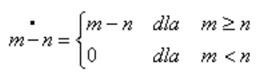

# Turing Machine Emulator

This program emulates Turing Machine which emulates difference between two numbers based on this rule:



## Features

- Converts provided numbers to unary notation
- Prints each step that the Turing Machine takes to achieve the result
- Analyzes final tape and print the conclusion


## Installation

To run this aplication you need enviroment that supports C language and Makefile software

To compile the code type:
```sh
make all
```
To run
```sh
./app
```
For clearing deleting file: 
```sh
make clear
```

## Author
Filip Kobus

### Description
Code was written due to my college task on the subject Basics of IT on WUT.
